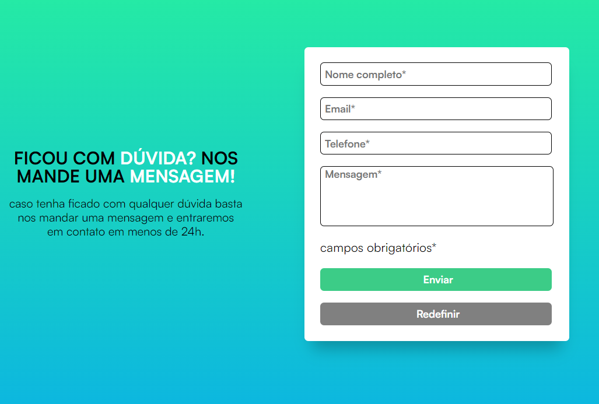

<h1 align="center"> <strong>📝Application Form | Project</strong></h1>

This is a <strong>simple</strong> form project made with HTML, CSS and JavaScript. The form has required fields that must be filled in before submission, otherwise the user will be alerted and required fields will be highlighted.

  <a href="#-tecnologies">Tecnologies</a>&nbsp;&nbsp;&nbsp;|&nbsp;&nbsp;&nbsp;
  <a href="#-project">Project</a>

  

## 🚀 Tecnologies

This project was developed with:

- HTML & CSS
- JavaScript
- Git & GitHub
---
## 💻 Project

1. <strong>HTML & CSS</strong>:
  - The initial structure with HTML I've thought in organising my containers through the tag form and adding up the following inputs which're necessary for this project. In addition with the properly formatted of html tags for the entire body.

  - As my HTML structure have been implemented, I've decided to work with the Flexbox technique to organize my containers and styling. Perhaps should I tried the grid layout which also works reasonably well and clean for this case.

  - Let's look into the insights for me about this project which was using the propertie 'resize: none' of the textarea through CSS changes, forbidden the user to resize the textarea.

  - Another amazing point which I've discovered was a website called https://cssgradient.io/ which I can create instantaneously any gradient that I want.

  2. <strong>JavaScript</strong>:
  - I've learned several different new ways of thinking about this project, even if it looks simple and is a completely basic challenge to understand and solve. But I really thriving in practice and leveling my understanding multiple times more in JavaScript after concluded this one.

  - My steps to accheive the logical solution for this was:
  - Create their main variables to getElementsById from my form and 
---
